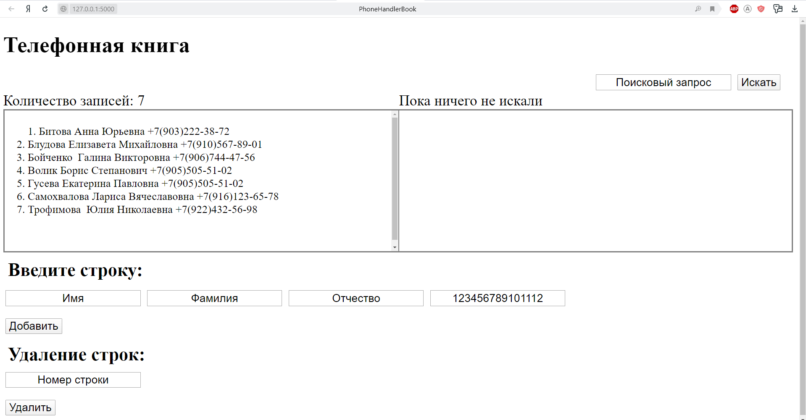

# Phone Book на Flask (Python) 🤙
`📇 Телефонная книга нужна для того, чтобы хранить важные номера или иметь базу клиентов, которые готовы у вас купить. Она также помогает собирать всё количество клиентов. Это очень **необходимая вещь каждому бизнесу!🚀`

## 👁️Ресурсы, которые использовал при создания:

* ##### Flask
```bash 
$pip install Flask
```
* ##### SQLite
```bash 
$pip install pysqlite3
```
## 👁️ Как работает:

`(Имена и номера вымышлены) `

## ⚙️Для запуска на вашем компьютере: 
- ##### **Создать виртуальное окружение(virtualenv) 💻**
- ##### Устанавливаем веб-фреймворк Flask.
- ##### Скопировать в созданную директорию окружения файлы: start.py, datebase.db; директории: static, templates 📌
- ##### Задать параметр запуска:
```Bash
SET FLASK_APP=start.py (Для Win)
```

### 📦Составляющие проекта:

- ##### 🔎pyvenv.cfg - `конфигурация виртуального окружения.`

- ##### 📝requirements.txt - текущие версии пакетов, получаем с помощью команды: 

```Bash
$pip freeze > requirements.txt
```

- ##### 🪄️static - стили.

- ##### 🎈templates - html шаблон. 

[](https://t.me/vvlad_islovv) 
[](https://discordapp.com/users/1144549294813224960/)
[](https://vk.com/vvlad_islovv)